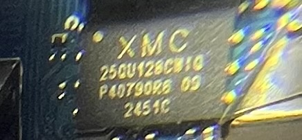

# XMC Spi Nor Flash 


`XMC 25QU128CWIQ`

```
cat /proc/mtd
dev:    size   erasesize  name
mtd0: 00010000 00001000 "bootinfo"
mtd1: 00010000 00001000 "private"
mtd2: 00040000 00001000 "fsbl"
mtd3: 00010000 00001000 "env"
mtd4: 00030000 00001000 "opensbi"
mtd5: 00f60000 00001000 "uboot"

root@orangepirv2:~/spi-backup# dd if=/dev/mtd0ro of=0bootinfo.bak.bin bs=64K
1+0 records in
1+0 records out
65536 bytes (66 kB, 64 KiB) copied, 0.00676279 s, 9.7 MB/s
root@orangepirv2:~/spi-backup# dd if=/dev/mtd1ro of=1private.bak.bin bs=64K
1+0 records in
1+0 records out
65536 bytes (66 kB, 64 KiB) copied, 0.00682904 s, 9.6 MB/s
root@orangepirv2:~/spi-backup# dd if=/dev/mtd2ro of=2fsbl.bak.bin bs=64K
4+0 records in
4+0 records out
262144 bytes (262 kB, 256 KiB) copied, 0.0253626 s, 10.3 MB/s
root@orangepirv2:~/spi-backup# dd if=/dev/mtd3ro of=3env.bak.bin bs=64K
1+0 records in
1+0 records out
65536 bytes (66 kB, 64 KiB) copied, 0.00678075 s, 9.7 MB/s
root@orangepirv2:~/spi-backup# dd if=/dev/mtd4ro of=4openbsi.bak.bin bs=64K
3+0 records in
3+0 records out
196608 bytes (197 kB, 192 KiB) copied, 0.0188 s, 10.5 MB/s
root@orangepirv2:~/spi-backup# dd if=/dev/mtd5ro of=5uboot.bak.bin bs=64K
dd: error reading '/dev/mtd5ro': Unknown error 524
182+0 records in
182+0 records out
11927552 bytes (12 MB, 11 MiB) copied, 1.11241 s, 10.7 MB/s
# [ 5744.795316] x1_qspi_supports_op: addr.val:12582912 greater than the map size

root@orangepirv2:~/spi-backup# sha256sum *
a04a1352e3ed041a9d3ce151c63bf1c9ebb462df1dde95c621df82bab8f5c948  0bootinfo.bak.bin
71189f7fb6aed638640078fba3a35fda6c39c8962e74dcc75935aac948da9063  1private.bak.bin
59af4b627194128ba6bef650ca46a5720ede7b8fb23669df2be917238f2d2df4  2fsbl.bak.bin
3db4816dd10fe615b153b4314d607eef0596a2beddadc7851c1ebe16b69ba3fa  3env.bak.bin
c1f7d702a80ae5e7dc52d62ef2577cbbb25c045d6dda3a49a872130518f48cc0  4openbsi.bak.bin
a3849a936948c58723ca6b1e969cf37871960665a49bd1634fa40503160818ea  5uboot.bak.bin
```
